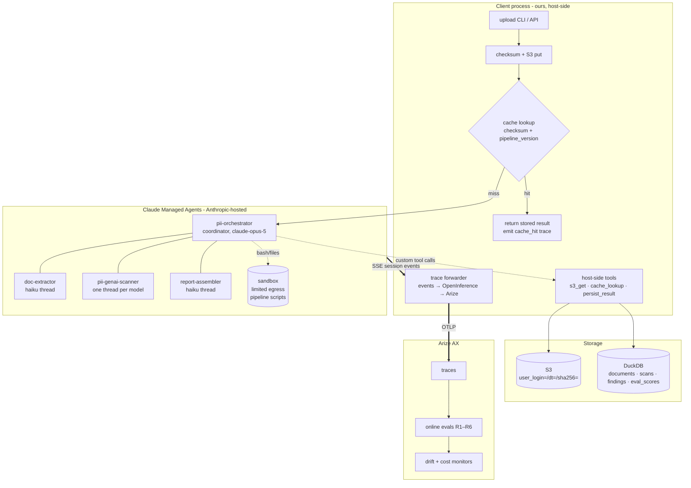
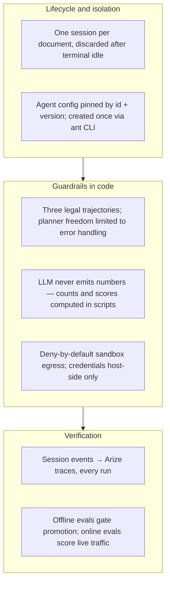

# Architecture

At the end you will know how a scan flows from upload to scored trace, which
component owns each step, and where the trust boundaries sit.

## High-level architecture

## Tech stack

The distinction that matters: the **harness** (who runs the agent loop) and
the **substrate** (who hosts the compute) are both Anthropic's here — but the
*client*, *storage*, and *observability* layers are ours and would survive a
harness change unchanged.

| Layer | Technology | Role here |
|---|---|---|
| Agent harness | Claude Managed Agents (beta) | The loop: orchestrator turns, subagent threads, tool dispatch |
| Hosting substrate | Anthropic per-session sandbox containers | Where bash/file/script tools execute; `limited` egress |
| Orchestrator model | claude-sonnet-5 (adaptive thinking, effort medium) | Plans and routes; never analyzes documents. Sonnet since v4 (2026-08-08) — routing isn't intelligence-bound, and sessions cost ~1/3 of Opus |
| Extraction model | env-resolved (`MODEL_PII_EXTRACTOR`) | The one generative step; Claude / GPT-class / DeepSeek |
| Deterministic engine | Microsoft Presidio + regex | The no-LLM baseline path |
| Client | Python 3.12 | Session driver, host-side tools, forwarder, eval harness |
| Storage | S3 (hive partitions) + DuckDB (ANSI-portable) | Uploads/results; scans/findings/eval scores |
| Observability | OpenInference/OTel → Arize AX | Traces, online evals, drift + cost monitors |

## Agent flow — the three legal trajectories

The orchestrator may follow exactly one of three paths per session
(enumerated in `agent/system_prompt.md`; any other sequence is a defect and a
HARD eval failure):

1. **Cache hit** — `cache_lookup` answers; no document fetch, no scan.
2. **Columnar reject** — the structure gate classifies the file as columnar;
   result is `skipped_out_of_scope`; no extraction, chunking, or detection.
3. **Full scan** — `s3_get` → doc-extractor (text layer, OCR fallback) →
   chunk → engine paths per manifest (Presidio in-sandbox; one GenAI scanner
   thread per model) → normalize → assemble → `persist_result` →
   report-assembler.

## Tool calling

| Tool | Kind | Allowed to touch |
|---|---|---|
| `bash` / `read` / `write` / `edit` / `glob` / `grep` | Sandbox toolset | The session workspace only; no network beyond `limited` allowlist |
| `web_search` / `web_fetch` | Sandbox toolset | **Disabled** — an agent scanning untrusted documents has no business browsing |
| `cache_lookup`, `persist_result` | Custom, host-side | Executed by the client with its own credentials; the sandbox never holds cloud keys |
| GenAI extraction (`pipeline/genai_detect.py`) | Host-side direct call | The one model call: typed per-chunk `messages.parse`, model from `MODEL_PII_EXTRACTOR`, grounding enforced in code (ungrounded findings dropped, bad spans stripped). Runs on the direct path — see the D2 amendment for why it is not in the sandbox |

## Agent-to-agent communication

The coordinator delegates via Managed Agents threads (one level deep). Threads
share the sandbox filesystem but not conversation history — the orchestrator
passes work as explicit messages, and subagent results come back as thread
messages. Raw document text lives in the doc-extractor and scanner threads
only; the orchestrator and report-assembler see counts, metadata, and the
normalized findings.

## Memory

None, deliberately. Sessions are one-shot and stateless; the only
cross-session state is the result cache in DuckDB, keyed by
`(checksum, pipeline_version)` — content-addressed, invalidated by
configuration change rather than TTL.

## Harness engineering

Read top to bottom: each run is isolated and reproducible (pinned agent
version), the loop is fenced by structural guardrails rather than prompt
pleading, and everything the fences allow is traced and scored.

## Prompt strategy

- **System prompt** (`agent/system_prompt.md`): trajectories + hard rules,
  fixed per agent version.
- **Skills** (`agent/skills/`): load-on-demand procedures — extraction order,
  normalization interpretation, report template.
- **Detection prompt** (`agent/skills/detection_prompt.md`): the extraction
  system prompt, resolved at runtime (override → env → file), versioned into
  `pipeline_version` so a prompt edit can never reuse a stale cache entry.

## Security

The trust boundary: **the uploaded document is hostile input.** It is parsed
only inside the sandbox; its text reaches two LLM contexts (extractor,
judge), and neither can emit anything except schema-validated findings.
Instructions embedded in a document are content to scan, never directives —
enforced structurally (no number the LLM emits reaches the result) and
verified by injection fixtures offline and judge criterion R6 live. Cloud
credentials never enter the sandbox; production traces carry no document text
(`TELEMETRY_RECORD_IO=false`). The full baseline is PRD §12.

Next: [Configuration](configuration.md)
