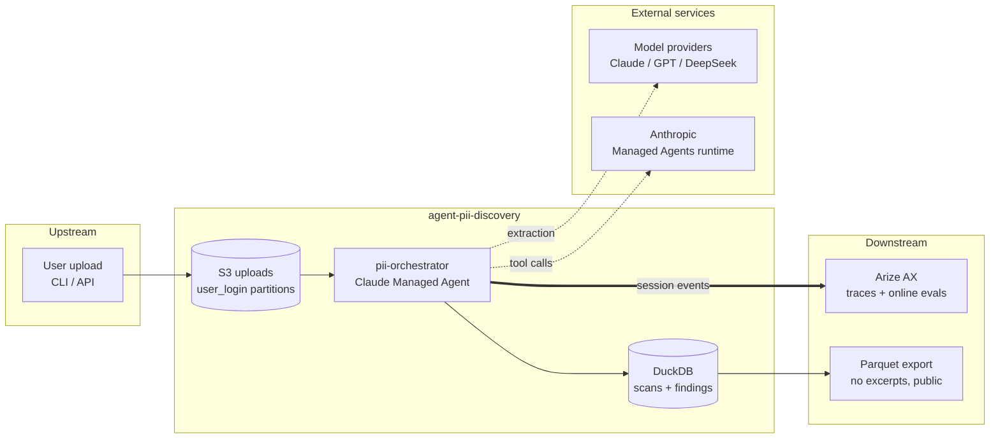

# Overview

## Purpose

agent-pii-discovery scans an uploaded document for sensitive personal data
(PII) and reports what it found, where, and which compliance regimes the
findings implicate. It exists to learn one thing well: **live evaluation** —
scoring an agent's real production traffic after the fact, instead of stopping
all measurement at the CI/CD gate. PII discovery is the vehicle because it has
clean ground truth: an email address either is in the document or it is not.

The agent runs on **Claude Managed Agents** (Anthropic hosts the agent loop
and a sandbox per run), and every run's trace lands in **Arize AX**, where
LLM-as-judge evaluators and drift monitors score real traffic without adding a
millisecond to the request path.

!!! note "Project status"
    Phase 0 of 6. The specification, agent configuration, eval rubrics, and
    the labeled fixture corpus exist; the pipeline and client code land in
    Phases 1–3. The phase gates live in the
    [openspec task list](https://github.com/senthilsweb/agent-pii-discovery/blob/main/openspec/changes/add-pii-discovery-agent/tasks.md).

## Use cases

- "Scan this contract before I share it — what PII is in it, and how sensitive?"
- "Run the same document through Presidio and three different LLMs and show me
  where they disagree."
- "Is our PII detection quality drifting this month compared to the offline
  baseline we shipped against?"
- "Which of last week's scans did the judge flag as ungrounded, and why?"

## Capabilities

- Detects PII along two paths: a deterministic engine (Microsoft Presidio +
  regex) and a GenAI engine with a switchable model (Claude, GPT-class,
  DeepSeek), selected by [`PII_ENGINE`](configuration.md).
- Normalizes every engine's output into one canonical 36-type entity schema,
  so cross-model comparison needs no re-scan.
- Maps findings to seven compliance regimes (GDPR, CCPA/CPRA, DPDP, PDPL-AR,
  HIPAA, LGPD, PIPEDA — spelled out in the
  [Glossary](glossary.md#compliance-regulatory-regimes)) by pure table lookup.
- Caches by content checksum + pipeline version: the same bytes are never
  scanned twice under the same configuration.
- Traces every run — tool calls, subagent threads, token usage — into Arize
  AX, where online evals score sampled traffic against a six-criterion rubric.

## Limitations

- Detection and reporting only — no redaction or masking.
- One-shot jobs: each upload is a single session, no multi-turn conversation.
- Not a data-governance product; it is a focused learning application.
- No GUI; the read surface is the report JSON, the operational database, and
  the published no-excerpt parquet export.

## Bounded context

**Responsibilities:** intake, dedup, scan, normalize, persist, trace.
**Upstream:** user uploads. **Downstream:** Arize AX (quality), the parquet
export (analytics). **Collaborating agents:** the orchestrator's own subagent
roster (doc-extractor, pii-genai-scanner, report-assembler) — see
[Architecture](architecture.md). **External:** Anthropic Managed Agents,
model providers, AWS S3, Arize AX.

Next: [Getting Started](getting-started.md)
